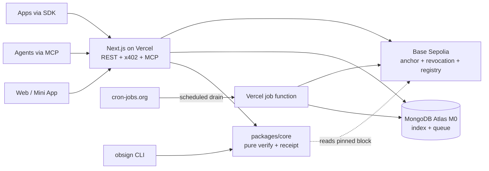

# Obsign — Product Requirements Document (PRD)

> **Product:** Obsign — verifiable credentials with recomputable receipts
> **Version:** 1.0 (v1 scope)
> **Status:** Approved for build
> **Owner:** Founding team
> **Last updated:** 2026-09-13
> **Repository:** `obsign/` (monorepo)
> **Target network:** Base Sepolia → Base mainnet at launch

---

## How to use this document (prompt-like)

This PRD is written so each phase can be handed, verbatim, to an implementation agent or engineer as a build prompt.

1. Work phases **in order**. Do not start a phase until the previous phase's *Acceptance Criteria* pass.
2. Each phase contains: **Objective**, **User Stories**, **Functional Requirements**, **Success Metrics**, **Deliverables**, **Acceptance Criteria**, **Test Plan**, and a copy-paste **Build Prompt**.
3. Treat every `FR-<phase>.<n>` as a testable requirement. Every requirement must map to at least one automated test or a documented manual check.
4. The **Non-negotiable invariants** below override any conflicting instruction. If a request would break one, stop and surface the conflict.

### Non-negotiable invariants

- **INV-1 — The core is pure.** `packages/core` performs no network I/O, reads no database, uses no ambient clock, and uses no randomness. The current time and any chain reader are injected.
- **INV-2 — Receipts are recomputable.** Any third party, offline, from the published spec and golden vectors, must reproduce a byte-identical `receiptId` for the same credential and evidence.
- **INV-3 — Payment never affects validity.** The verdict and `receiptId` must be identical whether computed via the paid API, the free CLI, or a third-party reimplementation.
- **INV-4 — The database is a cache.** MongoDB must never be required to recompute a receipt. All source data needed for verification is derivable from the credential, the evidence, and public chain state.
- **INV-5 — The LLM is outside the validity path.** Model output may select evidence, extract fields, or explain a result. It may never compute or influence `valid`/`invalid`, `reasonCode`, or `receiptId`.
- **INV-6 — Chain reads are pinned.** Onchain-event evidence is verified against a specific `blockNumber`/`blockHash` with a fixed confirmation depth. Never verify against `latest`.
- **INV-7 — No plaintext issuer keys in MongoDB.** Key material is accessed only through the `KeyProvider` interface.

---

## 1. Product overview

### 1.1 Vision

Anyone — a person, an app, or another AI agent — can prove a claim ("I attended this event", "this artifact is genuine", "this onchain action happened") with a **receipt that any third party can independently recompute**, and can pay a few cents per verification over x402.

### 1.2 Problem statement

Proof of a real-world or online fact is currently one of two bad options:

- A screenshot, PDF, or badge image that anyone can forge.
- A row in someone's private database that requires trusting that operator and dies with them.

There is no cheap, trustless primitive for proving "this happened" to a stranger or to another machine. AI agents now need to verify claims about the world at machine speed, and there is no payment-native, recomputable receipt format for them to do so.

### 1.3 Solution summary

Obsign is a **multi-issuer credential platform** built on three ideas:

1. **Proof/witness-based validity.** A credential is valid only when its evidence verifies: a co-signature quorum, a pinned onchain event, or an artifact hash.
2. **Recomputable receipts.** A receipt is `keccak256(JCS(credential) ‖ JCS(evidence))` plus a verdict. The hash depends only on canonical inputs, so anyone can recompute it.
3. **Machine-native payments.** `POST /verify` is gated by **x402** at a flat price per verification, so other agents can pay per call without accounts or invoices.

### 1.4 Target users

| Persona | Description | Primary need |
|---|---|---|
| **Issuer — Event organizer** | Runs conferences, workshops, hackathons, DAOs | Issue unforgeable attendance/role credentials cheaply |
| **Holder — Subject** | An attendee, contributor, or account | Hold a credential that any app can verify without trusting the issuer's server |
| **Verifier app — Integrator** | Gated chats, job boards, DAO tools, dapps | Verify a claim via API/SDK/contract without accounts |
| **Verifier agent — Machine consumer** | Another autonomous AI agent | Discover and call verification over MCP + x402 |
| **Auditor — Third party** | Skeptic, journalist, regulator | Recompute a receipt offline from published inputs |

### 1.5 Goals (v1)

- G1: Issue, anchor, and verify credentials with all three proof modules on Base Sepolia.
- G2: Produce receipts that are byte-for-byte recomputable via an independent CLI.
- G3: Support **multiple issuers** from day one via an onchain issuer registry.
- G4: Expose four surfaces over one shared core: REST + x402, MCP, onchain contract + SDK, web/Mini App.
- G5: Operate entirely on free tiers with no paid dependencies.
- G6: Ship a complete, production-quality landing page.

### 1.6 Non-goals (v1)

- NG1: Zero-knowledge or selective-disclosure privacy (public credentials only).
- NG2: Mainnet value-bearing deployments (Sepolia only; mainnet is a launch step, not v1 scope).
- NG3: Presence/QR and device attestation proof modules.
- NG4: Sybil resistance for open issuer registration.
- NG5: Any financial/trading functionality.

### 1.7 Locked decisions (do not re-litigate)

| # | Decision | Value |
|---|---|---|
| D1 | Product name | **Obsign** |
| D2 | Validity model | Proof / witness based |
| D3 | Trust boundary | Offchain deterministic core + onchain anchor |
| D4 | Agent role | LLM proposes, deterministic engine verifies |
| D5 | Tenancy | Multi-issuer from day one |
| D6 | Surfaces | REST+x402, MCP, contract/SDK, web + Mini App |
| D7 | Payment | Flat price per verification via x402 |
| D8 | Evidence primitives | Quorum, onchain-event, artifact-hash |
| D9 | Canonicalization | RFC 8785 (JCS) |
| D10 | Hash | keccak256 |
| D11 | Contracts | Immutable anchor + revocation + onchain issuer registry |
| D12 | Key custody | HD-derived per-issuer keys; `KeyProvider` abstraction |
| D13 | Network | Base Sepolia now, Base mainnet at launch |
| D14 | Data policy | Public receipts; encrypted, minimal-retention offchain evidence |
| D15 | Runtime | Vercel Hobby + MongoDB Atlas M0 + cron-jobs.org; Node.js |
| D16 | Language | TypeScript |

---

## 2. Core concepts and glossary

| Term | Definition |
|---|---|
| **Credential** | The claim issued to a subject, with issuer, subject, claim payload, evidence references, and validity window. |
| **Evidence** | Machine-checkable proof that supports a credential. One of `quorum`, `onchain-event`, `artifact-hash`. |
| **Receipt** | The canonical result object containing `receiptId`, verdict, `reasonCode`, and verification metadata. |
| **receiptId** | `keccak256(JCS(credential) ‖ JCS(evidence))`. The recomputable anchor of truth. |
| **Issuer** | An entity with a derived signing key, registered in the issuer registry. |
| **Subject** | The entity the credential is about (EVM address, Farcaster ID, or DID). |
| **Anchor** | The onchain event committing a `receiptId`/`credentialHash`. |
| **Revocation** | An onchain record invalidating a `credentialHash`. |
| **Verifier** | The deterministic engine that evaluates a credential + evidence. |
| **ReasonCode** | A specific machine-readable verdict reason (never a bare boolean). |

### 2.1 Reason codes (complete list)

```
OK
MALFORMED_CREDENTIAL
UNSUPPORTED_VERSION
MALFORMED_EVIDENCE
UNKNOWN_EVIDENCE_KIND
INVALID_ISSUER_SIGNATURE
UNKNOWN_ISSUER
ISSUER_NOT_ACTIVE
QUORUM_THRESHOLD_NOT_MET
UNKNOWN_QUORUM_SIGNER
DUPLICATE_QUORUM_SIGNER
QUORUM_MESSAGE_MISMATCH
EVENT_NOT_FOUND
INSUFFICIENT_CONFIRMATIONS
BLOCK_HASH_MISMATCH
EVENT_FIELD_MISMATCH
CHAIN_UNAVAILABLE
ARTIFACT_HASH_MISMATCH
ARTIFACT_UNREACHABLE
NOT_YET_VALID
EXPIRED
REVOKED
```

---

## 3. Architecture

### 3.1 Repository layout

```
obsign/
├── spec/
│   ├── receipt.md              # normative receipt + canonicalization spec
│   └── vectors/                # golden vectors (credential, evidence, expected receiptId)
├── packages/
│   ├── core/                   # pure verifier (INV-1)
│   │   ├── src/canonical.ts
│   │   ├── src/hash.ts
│   │   ├── src/receipt.ts
│   │   ├── src/modules/quorum.ts
│   │   ├── src/modules/onchain-event.ts
│   │   ├── src/modules/artifact-hash.ts
│   │   └── src/index.ts
│   └── sdk/                    # typed client + offline verifier → npm
├── apps/
│   ├── web/                    # Next.js on Vercel: landing, web app, Mini App, REST, x402, MCP
│   └── worker/                 # bounded job functions (drained by cron-jobs.org)
├── contracts/                  # Foundry project: anchor, revocation, issuer registry
└── cli/                        # standalone `obsign verify` for independent recomputation
```

### 3.2 Runtime topology



### 3.3 Receipt data model

**Credential**

```json
{
  "v": 1,
  "credentialId": "0x…",
  "issuer": "0x…",
  "subject": "0x… | fid:123 | did:key:…",
  "claim": {
    "type": "attendance | role | membership | artifact | custom",
    "context": "obsign-hackathon-2026",
    "details": {}
  },
  "evidenceRefs": ["0x…"],
  "issuedAt": "2026-09-13T00:00:00.000Z",
  "validFrom": "2026-09-13T00:00:00.000Z",
  "validUntil": "2027-09-13T00:00:00.000Z",
  "nonce": "0x…"
}
```

**Evidence — quorum**

```json
{
  "v": 1,
  "kind": "quorum",
  "credentialHash": "0x…",
  "threshold": 2,
  "messageHash": "0x…",
  "signers": [
    { "address": "0x…", "signature": "0x…" },
    { "address": "0x…", "signature": "0x…" }
  ]
}
```

**Evidence — onchain-event**

```json
{
  "v": 1,
  "kind": "onchain-event",
  "chainId": 84532,
  "address": "0x…",
  "blockNumber": 12345678,
  "blockHash": "0x…",
  "txHash": "0x…",
  "logIndex": 3,
  "confirmations": 12,
  "expect": { "event": "Transfer(address,address,uint256)", "topics": [], "data": "0x…" }
}
```

**Evidence — artifact-hash**

```json
{
  "v": 1,
  "kind": "artifact-hash",
  "algo": "sha256",
  "hash": "0x…",
  "uri": "ipfs://… | https://… | gridfs://…",
  "mime": "image/png",
  "bytes": 12345
}
```

**Receipt**

```json
{
  "v": 1,
  "receiptId": "0x…",
  "credentialHash": "0x…",
  "evidenceHash": "0x…",
  "result": "valid | invalid",
  "reasonCode": "OK",
  "issuer": "0x…",
  "subject": "0x…",
  "verifiedAt": "2026-09-13T00:00:00.000Z",
  "verifier": "obsign-core/1.0.0",
  "anchor": { "chainId": 84532, "txHash": "0x…", "blockNumber": 12345678 },
  "paid": false
}
```

### 3.4 Canonicalization procedure (normative — see `spec/receipt.md`)

1. Validate credential against the JSON Schema; reject with `MALFORMED_CREDENTIAL` on failure.
2. Validate each evidence item; reject with `MALFORMED_EVIDENCE`/`UNKNOWN_EVIDENCE_KIND`.
3. Sort `evidenceRefs` by canonical byte order.
4. Canonicalize credential and evidence with **RFC 8785 (JCS)**.
5. `credentialHash = keccak256(utf8(JCS(credential)))`.
6. `evidenceHash = keccak256(utf8(JCS(evidenceSet)))`.
7. `receiptId = keccak256(concat(credentialHash, evidenceHash))`.
8. Verdict metadata is appended **outside** the hashed inputs.

---

## 4. Cross-cutting requirements

### 4.1 Security

- **SEC-1** No plaintext private keys in MongoDB, logs, or client bundles (INV-7).
- **SEC-2** All issuer-authenticated endpoints verify an issuer session token bound to the derived issuer address.
- **SEC-3** Rate-limit issuance per issuer; rate-limit verification per payer.
- **SEC-4** Reject webhook/cron calls without `CRON_SECRET`.
- **SEC-5** Evidence payloads are size-capped; artifact payloads are never parsed as executable.
- **SEC-6** x402 payment proofs are single-use; replay is rejected and logged.
- **SEC-7** No secrets in the repository; `.env.example` documents every variable.

### 4.2 Key custody (`KeyProvider`)

```ts
interface KeyProvider {
  deriveIssuerKey(issuerIndex: number): Promise<{ address: `0x${string}`; sign: (hash: `0x${string}`) => Promise<`0x${string}`> }>;
}
```

- **KC-1** v1 provider reads a single HD seed from an encrypted environment variable; derives keys by index (`m/44'/60'/0'/0/{index}`).
- **KC-2** Swap to KMS/Vault is a new `KeyProvider` implementation only; no issuer logic changes.
- **KC-3** Migration to managed KMS is **mandatory before Base mainnet with real value**.
- **KC-4** Key operations are audit-logged (issuerIndex, address, operation, timestamp).

### 4.3 Free-tier constraints (hard design limits)

- **FT-1** Every queue job must complete within a Vercel Hobby function timeout; jobs are small and idempotent.
- **FT-2** MongoDB M0 is 512 MB: store hashes and metadata, not raw evidence blobs; evidence goes through `EvidenceStore`.
- **FT-3** `cron-jobs.org` is the retry safety net; immediate work is webhook-triggered.
- **FT-4** Vercel Hobby is non-commercial; Pro (~$20/mo) is required at commercial launch.
- **FT-5** No service with a mandatory paid tier may be introduced into v1.

### 4.4 Observability

- **OBS-1** Structured JSON logs with `receiptId`, `reasonCode`, `issuer`, `durationMs`, `paid`.
- **OBS-2** An append-only public verification log (also committed to a public GitHub repo on schedule) enumerating `receiptId`, verdict, and anchor tx.
- **OBS-3** Health endpoint reports DB, chain RPC, and queue depth.

---

## 5. Phased development plan

| Phase | Name | Outcome |
|---|---|---|
| 0 | Foundations & Spec | Monorepo, canonicalization spec, golden vectors, CI |
| 1 | Deterministic Core & CLI | Pure verifier + three modules + `obsign verify` |
| 2 | Onchain Layer | Contracts on Base Sepolia, SDK read path |
| 3 | Issuance & Multi-Issuer Platform | Issuer onboarding, keys, DB, queue, anchoring |
| 4 | Verification API, x402 & MCP | Paid verify endpoint, MCP tools, SDK publish |
| 5 | Landing Page, Web App & Mini App | Complete landing page + product UI + Farcaster Mini App |
| 6 | Hardening & Mainnet Launch | Audit, KMS migration, mainnet deploy, launch |

---

## Phase 0 — Foundations & Spec

**Estimated effort:** 2–4 days
**Depends on:** nothing

### Objective

Establish the monorepo, the normative receipt specification, and a golden-vector test harness so that every later phase is measured against a frozen, recomputable contract.

### User stories

| ID | As a… | I want… | So that… |
|---|---|---|---|
| US-0.1 | Engineer | a monorepo with typed packages and CI | I can build without integration drift |
| US-0.2 | Auditor | a normative spec for receipts | I can reimplement verification independently |
| US-0.3 | Engineer | golden vectors injected into tests | determinism is enforced from day one |

### Functional requirements

- **FR-0.1** Monorepo with workspaces: `spec`, `packages/core`, `packages/sdk`, `apps/web`, `apps/worker`, `contracts`, `cli`.
- **FR-0.2** TypeScript strict mode; shared `tsconfig`; ESLint + Prettier.
- **FR-0.3** `spec/receipt.md` is normative: fields, canonicalization, hash order, reason codes, version policy.
- **FR-0.4** `spec/vectors/` contains ≥ 12 vectors: 3 valid per evidence kind, 3 invalid per kind, plus malformed cases.
- **FR-0.5** Vector loader reads vectors in tests and asserts `receiptId` and `reasonCode`.
- **FR-0.6** CI runs install, typecheck, lint, and vector tests on every push.
- **FR-0.7** `README.md` documents local setup and the invariant list.

### Success metrics

- 100% of golden vectors load and execute in CI.
- CI green on a clean clone within 5 minutes.
- Spec review: a second person reconstructs one `receiptId` by hand from the spec alone.

### Deliverables

- Monorepo skeleton, CI workflow, `spec/receipt.md`, `spec/vectors/*.json`, vector test harness.

### Acceptance criteria

- [ ] `npm test` executes all vectors and passes.
- [ ] A clean clone + install + test works with no undocumented steps.
- [ ] The spec contains no ambiguous hash ordering.

### Test plan

- Unit: vector loader, schema validation.
- Manual: hand-recompute one vector using `jq` + a keccak tool; record the result in `spec/vectors/README.md`.

### Build prompt

> You are implementing Phase 0 of Obsign. Create a TypeScript monorepo with the exact layout in §3.1. Write `spec/receipt.md` as the normative receipt and canonicalization specification matching §3.4, including the complete reason-code list. Create `spec/vectors/` with at least 12 golden vector files, each containing `credential`, `evidence`, `expectedReceiptId`, and `expectedReasonCode`. Add a vitest harness that loads every vector and asserts both values. Configure strict TypeScript, ESLint, and a GitHub Actions CI workflow running install → typecheck → lint → test. Do not implement the verification logic yet; the vectors are the contract. Ensure no plaintext keys or secrets are committed.

---

## Phase 1 — Deterministic Core & CLI

**Estimated effort:** 1–2 weeks
**Depends on:** Phase 0

### Objective

Build the pure `packages/core` verifier with all three evidence modules and a standalone CLI that reproduces receipts offline, satisfying INV-1, INV-2, and INV-3.

### User stories

| ID | As a… | I want… | So that… |
|---|---|---|---|
| US-1.1 | Verifier app | a pure `verify(credential, evidence, ctx)` | I can embed verification anywhere |
| US-1.2 | Auditor | `obsign verify` to recompute a receipt offline | I don't have to trust the API |
| US-1.3 | Issuer | specific reason codes | I can debug failed credentials precisely |
| US-1.4 | Engineer | injected clock and chain reader | tests are deterministic and reproducible |

### Functional requirements

- **FR-1.1** `canonical.ts` implements RFC 8785 (JCS) with no locale or platform dependence.
- **FR-1.2** `hash.ts` exposes `keccak256` and a deterministic `utf8` encoder.
- **FR-1.3** `verify(credential, evidence, ctx)` returns `{ result, reasonCode, receiptId, credentialHash, evidenceHash }`.
- **FR-1.4** `ctx` contains `{ now: string, chain: ChainReader }`; no other ambient input exists.
- **FR-1.5** Quorum module: validates threshold, signer set, uniqueness, and message hash; returns specific reason codes.
- **FR-1.6** Onchain-event module: resolves the pinned block, asserts `blockHash`, confirms depth, asserts tx/log address, topics, and optional data.
- **FR-1.7** Artifact-hash module: recomputes the SHA-256 of fetched bytes via `EvidenceStore` and compares.
- **FR-1.8** Evidence modules are selected by `kind`; unknown kinds return `UNKNOWN_EVIDENCE_KIND`.
- **FR-1.9** Credential signature verification (EIP-191/EIP-712) against the issuer address.
- **FR-1.10** `cli/` provides `obsign verify --credential f.json --evidence e.json --chain rpc --out receipt.json`.
- **FR-1.11** CLI supports `--offline` for quorum/artifact vectors with local files.

### Success metrics

- 100% of golden vectors pass in core and via the CLI.
- Same vector produces byte-identical `receiptId` across: two OSes, two Node versions, and after a process restart.
- No `Date.now()`, `Math.random()`, `fetch`, or DB imports inside `packages/core` (enforced by lint rule).

### Deliverables

- `packages/core`, `cli/`, unit + property tests, determinism test suite.

### Acceptance criteria

- [ ] `packages/core` contains zero network/DB/clock/random references (CI check).
- [ ] CLI reproduces every valid vector's `receiptId` exactly.
- [ ] Every reason code in §2.1 is reachable by at least one test.
- [ ] Mutating any single byte of a credential changes `receiptId`.

### Test plan

- Unit + table tests per module.
- Property tests: reorder JSON keys → same hash; flip one byte → different hash.
- Cross-process: write receipt in one process, assert equality in a fresh process.
- Cross-platform: CI matrix (Linux + Windows).
- Adversarial: forged quorum signatures, duplicate signers, reorged block, wrong `blockHash`, tampered artifact.

### Build prompt

> You are implementing Phase 1 of Obsign. Build `packages/core` in strict TypeScript with a pure `verify(credential, evidence, ctx)` where `ctx = { now, chain }`. Implement RFC 8785 canonicalization, keccak256 hashing, credential signature verification, and three evidence modules (quorum, onchain-event, artifact-hash) returning the reason codes in the spec. Implement a CLI `obsign verify` that produces a receipt JSON identical to the core output, with an `--offline` mode for local vectors. Add unit tests, property tests (key reorder unchanged, byte flip changed), a cross-process determinism test, and a CI check that `packages/core` contains no `fetch`, `Date.now`, `Math.random`, or database imports. All Phase 0 golden vectors must pass.

---

## Phase 2 — Onchain Layer

**Estimated effort:** 1 week
**Depends on:** Phase 1

### Objective

Deploy immutable anchor, revocation, and issuer-registry contracts to Base Sepolia, and expose an SDK read path that feeds pinned chain data to the core.

### User stories

| ID | As a… | I want… | So that… |
|---|---|---|---|
| US-2.1 | Issuer | to anchor a receipt hash on Base | the credential is publicly timestamped |
| US-2.2 | Issuer | to revoke a credential | compromised credentials stop validating |
| US-2.3 | Issuer | to register my issuer address | consumers can resolve who I am |
| US-2.4 | Verifier app | to read anchors and revocations from chain | I don't trust the Obsign API |
| US-2.5 | Auditor | immutable contracts with no admin key | the rules can't be changed silently |

### Functional requirements

- **FR-2.1** `ObsignAnchor`: `anchor(bytes32 receiptId, bytes32 credentialHash)`, emits `Anchored`; `isAnchored(bytes32) view`.
- **FR-2.2** `ObsignRevocation`: `revoke(bytes32 credentialHash)`, emits `Revoked`; `isRevoked(bytes32) view`.
- **FR-2.3** `ObsignIssuerRegistry`: permissionless `registerIssuer(bytes32 metadataHash)`; `statusOf(address) view`; events `IssuerRegistered`, `IssuerUpdated`.
- **FR-2.4** Contracts are immutable (no proxy, no owner/admin) — consistent with D11.
- **FR-2.5** `ChainReader` interface in core implemented in SDK using viem: `getBlock`, `getLogs`, `readContract`.
- **FR-2.6** A deploy script writes addresses to `contracts/deployments/84532.json`.
- **FR-2.7** Issuer metadata is stored offchain; only its hash is committed.
- **FR-2.8** Gas estimation and a dry-run mode precede every write.

### Success metrics

- Anchor, revocation, and registration each confirmed on Base Sepolia within one transaction.
- Reading a pinned event through `ChainReader` reproduces the same `receiptId` as the offline vector for that event.
- Contract test coverage ≥ 95% of branches.

### Deliverables

- Foundry contracts + tests, deploy scripts, `deployments/84532.json`, SDK `ChainReader`.

### Acceptance criteria

- [ ] Three contracts deployed and verified on BaseScan Sepolia.
- [ ] `isAnchored`/`isRevoked`/`statusOf` return correct values in tests.
- [ ] A revoked credential verifies as `REVOKED` through the full core path.
- [ ] No function exists that can alter a previously written anchor.

### Test plan

- Foundry: unit + fuzz for duplicate anchors, unauthorized revoke semantics, registry re-registration.
- Integration: anvil fork of Base Sepolia; anchor → read → core verify.
- Reorg simulation: mine, verify, roll back the fork, assert `BLOCK_HASH_MISMATCH`/`EVENT_NOT_FOUND` and fail-closed behavior.

### Build prompt

> You are implementing Phase 2 of Obsign. Create a Foundry project in `contracts/` with three immutable contracts — `ObsignAnchor`, `ObsignRevocation`, `ObsignIssuerRegistry` — matching the function signatures and events in FR-2.1–2.3. No proxies, no owner/admin. Write comprehensive Foundry tests including fuzz tests and a reorg simulation on an anvil fork. Write a deploy script that deploys all three to Base Sepolia and writes `contracts/deployments/84532.json`. Implement a `ChainReader` in `packages/sdk` using viem that reads pinned blocks and logs. Add an integration test that anchors a real `receiptId`, then verifies it through `packages/core` with a pinned chain read.

---

## Phase 3 — Issuance & Multi-Issuer Platform

**Estimated effort:** 2–3 weeks
**Depends on:** Phase 2

### Objective

Deliver multi-issuer onboarding, key derivation, credential issuance, durable queueing, anchoring, and revocation — on the free-tier runtime.

### User stories

| ID | As a… | I want… | So that… |
|---|---|---|---|
| US-3.1 | Issuer | to create an account and receive a derived issuer address | I can start issuing immediately |
| US-3.2 | Issuer | to issue a credential with evidence | my subjects get provable credentials |
| US-3.3 | Issuer | to revoke a credential | I can correct mistakes |
| US-3.4 | Issuer | my anchor to be retried if it fails | credentials don't silently lose their anchor |
| US-3.5 | Operator | to see queue depth and issuer activity | I can detect problems early |
| US-3.6 | Auditor | issuer metadata hashed onchain | I can confirm who issued what |

### Functional requirements

- **FR-3.1** `KeyProvider` per §4.2; `deriveIssuerKey(index)`; audit log of key operations.
- **FR-3.2** MongoDB collections: `issuers`, `credentials`, `evidence`, `receipts`, `anchors`, `revocations`, `queue`, `audit`.
- **FR-3.3** Issuer onboarding: create issuer record, assign derivation index, register onchain, store metadata hash.
- **FR-3.4** `POST /api/v1/credentials` (issuer-auth) creates a credential, persists it, and enqueues an anchor job.
- **FR-3.5** Anchor job: simulate, send tx, confirm ≥ 12 blocks, update `anchors`.
- **FR-3.6** `POST /api/v1/credentials/:id/revoke` sends a revocation tx and updates `revocations`.
- **FR-3.7** MongoDB lease-based queue: `enqueue`, `lease`, `ack`, `nack`, `reapExpired`.
- **FR-3.8** `apps/worker` expose bounded job handlers invoked by HTTP (cron + webhook), guarded by `CRON_SECRET`.
- **FR-3.9** `cron-jobs.org` drains due jobs on a schedule; webhooks trigger immediate drains.
- **FR-3.10** `EvidenceStore` interface with a GridFS implementation and a size cap.
- **FR-3.11** Every job is idempotent and safe to run twice.

### Success metrics

- A new issuer can register and issue a first anchored credential in under 5 minutes.
- ≥ 99% of anchor jobs confirm without manual intervention; retried failures resolve via cron.
- Zero plaintext keys observed in DB scans or logs (automated check).

### Deliverables

- Issuer service, worker handlers, queue, KeyProvider, EvidenceStore, audit log, admin status view.

### Acceptance criteria

- [ ] Two distinct issuers can both issue and anchor credentials.
- [ ] Keys are only ever accessed through `KeyProvider`.
- [ ] Killing a job mid-flight and re-running it does not double-anchor beyond idempotent retries.
- [ ] Revocation reflected in verification within one cron cycle.

### Test plan

- Unit: derivation determinism, queue lease/reap, idempotency.
- Integration: issue → enqueue → drain → anchor → read back; revoke → verify.
- Failure injection: RPC timeout, duplicate enqueue, expired lease, worker crash.
- Security: grep-based CI assertion that no key material appears in logs/DB fixtures.

### Build prompt

> You are implementing Phase 3 of Obsign. Add MongoDB Atlas collections for issuers, credentials, evidence, receipts, anchors, revocations, queue, and audit. Implement a `KeyProvider` that derives per-issuer keys from a single HD seed in an encrypted environment variable, with an audit log; no key access outside the provider. Implement issuer onboarding with onchain registration and metadata-hash commitment, `POST /api/v1/credentials`, `POST /api/v1/credentials/:id/revoke`, and an idempotent MongoDB lease-based queue with enqueue/lease/ack/nack/reap. Implement bounded worker handlers invoked over HTTP, protected by `CRON_SECRET`, driven by cron-jobs.org and webhooks. Add an `EvidenceStore` with a GridFS implementation and size caps. Write unit, integration, failure-injection, and key-leak tests.

---

## Phase 4 — Verification API, x402 & MCP

**Estimated effort:** 1–2 weeks
**Depends on:** Phase 3

### Objective

Expose the pure core as a paid, machine-consumable verification service over REST + x402 and MCP, and publish the SDK.

### User stories

| ID | As a… | I want… | So that… |
|---|---|---|---|
| US-4.1 | Verifier app | `POST /api/v1/verify` | I can verify a credential server-side |
| US-4.2 | AI agent | to discover and pay for verification over MCP + x402 | I can verify without accounts |
| US-4.3 | Developer | an npm SDK | I can integrate quickly |
| US-4.4 | Auditor | the paid and free paths to agree | I trust the economic gate |
| US-4.5 | Payer | a clear 402 challenge and receipt | I know what I paid for |

### Functional requirements

- **FR-4.1** `POST /api/v1/verify` accepts `{ credential, evidence }`, returns a Receipt.
- **FR-4.2** x402 middleware returns `402` with payment requirements when unpaid; settles and returns the receipt when paid.
- **FR-4.3** Flat price per verification configured by `X402_PRICE_USDC`; payee `X402_PAYEE_ADDRESS`; facilitator `X402_FACILITATOR_URL`.
- **FR-4.4** x402 payment proofs are single-use; replay returns `402` and is logged.
- **FR-4.5** `GET /api/v1/receipts/:receiptId`, `GET /api/v1/credentials/:id`, `GET /api/v1/issuers/:address`.
- **FR-4.6** MCP endpoint at `/api/mcp` (streamable HTTP) with tools: `obsign_verify`, `obsign_issue`, `obsign_get_receipt`, `obsign_get_issuer`.
- **FR-4.7** `obsign_verify` is x402-gated identically to REST.
- **FR-4.8** `packages/sdk` exposes `verify()`, `issue()`, `getReceipt()`, `getIssuer()`, and offline verification; published to npm.
- **FR-4.9** `GET /api/v1/health` reports DB, RPC, and queue depth.
- **FR-4.10** All responses use the versioned receipt schema; unknown `v` returns `UNSUPPORTED_VERSION`.

### Success metrics

- Full loop (402 → pay → settle → receipt) completes on Base Sepolia.
- SDK and CLI produce identical `receiptId` for the same inputs (INV-3 verified in CI).
- MCP tool list is discoverable by a standard MCP client.

### Deliverables

- Verify endpoint, x402 middleware, MCP server, published SDK, health endpoint.

### Acceptance criteria

- [ ] Unpaid request returns a valid x402 402 challenge.
- [ ] Paid request returns a receipt whose `receiptId` equals the CLI's.
- [ ] Replaying a payment proof fails.
- [ ] MCP `obsign_verify` returns the same verdict as REST.
- [ ] npm SDK installs and verifies a vector offline.

### Test plan

- Integration: x402 challenge/settlement with a test facilitator; replay rejection; underpayment.
- Equivalence: property test asserting API == CLI `receiptId` across all vectors.
- MCP: conformance test with a standard MCP client.
- SDK: install-from-tarball smoke test.

### Build prompt

> You are implementing Phase 4 of Obsign. Add `POST /api/v1/verify` backed by `packages/core`, wrapped in x402 middleware with a flat `X402_PRICE_USDC`, payee, and facilitator from environment. Ensure payment proofs are single-use and replay is rejected. Add read endpoints for receipts, credentials, and issuers, plus a health endpoint. Implement an MCP streamable-HTTP endpoint exposing `obsign_verify`, `obsign_issue`, `obsign_get_receipt`, `obsign_get_issuer`, with `obsign_verify` x402-gated. Publish `packages/sdk` to npm with API and offline verification. Add integration tests for the 402→settle→receipt loop, replay rejection, REST/MCP equivalence, and a CI assertion that API and CLI `receiptId`s are identical for every golden vector.

---

## Phase 5 — Landing Page, Web App & Mini App

**Estimated effort:** 2 weeks
**Depends on:** Phase 4

### Objective

Ship a complete, production-quality landing page plus the human product: verify, issue, and manage credentials on web and as a Farcaster Mini App.

### 5.1 Landing page — complete specification

**Purpose:** convince an issuer, a developer, and a skeptic in under 30 seconds that Obsign credentials are verifiable, and let them verify one live without signing up.

**Route:** `/`

**Information architecture (top to bottom):**

1. **Sticky nav**
   - Left: `Obsign` wordmark (links `/`).
   - Center: `How it works` · `Verify` · `Issuers` · `Developers` · `Docs`.
   - Right: `GitHub` (icon), primary button `Verify a credential`.
   - Mobile: hamburger → full-height sheet; primary CTA always visible.

2. **Hero**
   - Eyebrow: `Proof, not promises.`
   - H1: `Credentials anyone can recompute.`
   - Sub: `Obsign turns “I was there” or “this is genuine” into a receipt that any person, app, or AI agent verifies independently — no trust in our server required.`
   - CTAs: primary `Verify a credential` (scrolls to the live widget); secondary `Issue credentials` (`/issue`).
   - Right side: **Live verify widget** — input for `receiptId` or a credential/evidence JSON paste + `Verify` button.
   - Trust row: `Built on Base` · `x402 payments` · `MCP-native` · `Open spec`.

3. **Live verify widget (component: `<VerifyWidget/>`)**
   - States: `idle`, `validating`, `valid` (green, shows `receiptId`, `reasonCode: OK`, anchor tx link), `invalid` (amber, shows `reasonCode`), `error` (red, retry), `unpaid` (402 explanation).
   - Behavior: calls `POST /api/v1/verify`; if unpaid, renders the x402 challenge and a `Pay & verify` action.
   - Empty state: `Paste a receipt ID or credential JSON to begin.` plus a `Try a sample` link that loads a known-good vector.
   - Always shows the recomputation panel: `credentialHash`, `evidenceHash`, `receiptId`, and a copy button.

4. **Problem**
   - Three columns with short copy: `Screenshots are forgeable`, `Databases must be trusted`, `Agents can't ask permission`.

5. **How it works**
   - Three numbered steps: `Issue` → `Anchor` → `Verify`, each with an icon and one sentence.
   - Inline mini-diagram of `credential + evidence → receiptId` and the Base anchor.

6. **The receipt (interactive)**
   - An annotated JSON receipt with tooltips on `receiptId`, `credentialHash`, `reasonCode`.
   - A `Recompute it yourself` tab showing the CLI command and its output.

7. **Verifier modules**
   - Three cards: **Quorum**, **Onchain event**, **Artifact hash**, each with a one-line description and an example.

8. **For issuers**
   - Benefits list (multi-issuer, onchain registry, revocation, flat pricing).
   - CTA `Become an issuer`.

9. **For developers**
   - Tabbed snippets: `REST + x402`, `MCP`, `SDK`, `Contract`.
   - Copy button per snippet; link to `/docs`.

10. **Onchain proof**
    - Live counter of anchored receipts and a table of the last 5 anchors (tx link, issuer, time) read from Base Sepolia.

11. **Pricing**
    - Single card: `Flat price per verification. No subscriptions, no signup.` Amount from env/config.
    - Note: `Free during the pilot on testnet.`

12. **FAQ**
    - Accordion: `Can I verify without trusting Obsign?`, `What stops someone faking a credential?`, `Is it private?`, `What does it cost?`, `Which chains?`, `Is it open source?`

13. **Final CTA**
    - `Verify your first credential` + email capture for launch (double opt-in, stored minimally).

14. **Footer**
    - Columns: Product (`Verify`, `Issue`, `Docs`, `Status`), Developers (`GitHub`, `npm`, `MCP`, `Contract`), Company (`About`, `Privacy`, `Terms`), and a `Base Sepolia` network badge. Copyright.

**Copy rules:** no “AI-powered”, no “revolutionary”, no emoji in headings; short sentences; every claim links to a verifiable artifact (tx, spec, repo).

**Functional requirements**

- **FR-5.1** Landing page implements all 14 sections with responsive layouts at 360 / 768 / 1280 px.
- **FR-5.2** `<VerifyWidget/>` implements all six states and the recomputation panel.
- **FR-5.3** `Try a sample` loads a bundled valid vector and verifies it.
- **FR-5.4** Developer snippets are copyable and use real endpoint/contract names.
- **FR-5.5** The onchain proof table reads live Base Sepolia anchors and degrades gracefully when RPC fails.
- **FR-5.6** Static metadata: title, description, canonical URL, Open Graph and Twitter cards, `opengraph-image`.
- **FR-5.7** `/.well-known/farcaster.json` manifest served; `fc:miniapp`/`fc:frame` embeds on `/` and receipt pages.
- **FR-5.8** After a successful verify or issue, offer a Farcaster share action.
- **FR-5.9** Accessibility: WCAG 2.1 AA, keyboard-navigable, visible focus, `aria-live` on widget verdicts.
- **FR-5.10** Performance: Lighthouse ≥ 95 performance/accessibility/SEO on mobile.
- **FR-5.11** No wallet required to verify; wallet required only to issue/redeem.

**Web app routes**

- `/` landing (above)
- `/verify` full-page verifier (deep-linkable `?receiptId=`)
- `/issue` issuer onboarding + issue form (wallet/auth gated)
- `/credentials` issuer dashboard: list, status, anchor tx, revoke
- `/receipt/[receiptId]` permalink receipt with share embeds
- `/docs` rendered spec + API/MCP/SDK reference
- `/status` health and queue depth

**Mini App**

- **FR-5.12** Same build serves web and Farcaster Mini App; context never grants issue rights.
- **FR-5.13** Mini App supports: connect wallet, verify a credential, view a receipt, share.

### User stories

| ID | As a… | I want… | So that… |
|---|---|---|---|
| US-5.1 | Skeptic | to verify a credential on the landing page | I believe the product without signing up |
| US-5.2 | Issuer | a dashboard to issue and revoke | I can operate day to day |
| US-5.3 | Developer | copyable REST/MCP/SDK examples | I can integrate in minutes |
| US-5.4 | Mobile user | a responsive, accessible page | I can use it on any device |
| US-5.5 | Farcaster user | to verify and share in-app | distribution comes free |

### Success metrics

- Landing → verify-widget interaction ≥ 20% of visitors.
- Verify completion rate ≥ 60% of started verifications.
- Issuer signup → first anchor ≥ 30% within 24h.
- Lighthouse mobile ≥ 95 across performance/accessibility/SEO.
- Zero critical accessibility violations (axe).

### Deliverables

- Landing page, verify widget, web app routes, Mini App, docs, metadata, status page.

### Acceptance criteria

- [ ] All 14 landing sections present and responsive.
- [ ] All six widget states demonstrated; sample vector verifies successfully.
- [ ] Deep links (`/verify?receiptId=`, `/receipt/[id]`) render correctly.
- [ ] Mini App manifest valid; share works after verify.
- [ ] axe and Lighthouse thresholds met.

### Test plan

- Playwright E2E: hero → sample verify → valid receipt → share; unpaid → 402 → pay → valid.
- Visual regression at 360/768/1280.
- Accessibility: axe in CI on every route.
- Metadata: assert OG/Twitter tags and manifest JSON in tests.
- RPC-failure: assert the onchain table degrades without breaking layout.

### Build prompt

> You are implementing Phase 5 of Obsign. Build the complete landing page at `/` exactly as specified in §5.1 with all 14 sections, responsive at 360/768/1280px, plus the `<VerifyWidget/>` with all six states and a recomputation panel. Add `/verify`, `/issue`, `/credentials`, `/receipt/[receiptId]`, `/docs`, and `/status`. Wire verify to `POST /api/v1/verify`, render the x402 402 challenge when unpaid, and offer a `Pay & verify` action. Add static metadata, OG/Twitter cards, `opengraph-image`, and a Farcaster Mini App manifest with `fc:miniapp`/`fc:frame` embeds and a share action after verify or issue. No wallet required to verify. Meet WCAG 2.1 AA and Lighthouse ≥ 95 on mobile. Add Playwright E2E tests, axe checks, visual regression at three widths, and metadata assertions.

---

## Phase 6 — Hardening & Mainnet Launch

**Estimated effort:** 1–2 weeks
**Depends on:** Phase 5

### Objective

Harden security and observability, migrate key custody to managed KMS, deploy to Base mainnet, and launch publicly.

### User stories

| ID | As a… | I want… | So that… |
|---|---|---|---|
| US-6.1 | Operator | alerting on anchor failures and queue backlog | incidents are caught fast |
| US-6.2 | Security reviewer | evidence of an external audit | I trust mainnet deployment |
| US-6.3 | Issuer | keys held in managed KMS | custody risk is minimized |
| US-6.4 | User | uptime and a status page | I can see system health |

### Functional requirements

- **FR-6.1** `KmsKeyProvider` implementation (AWS/GCP KMS or Vault) behind the existing interface (KC-2/KC-3).
- **FR-6.2** Migrate all issuer keys to KMS with zero-downtime rotation.
- **FR-6.3** Alerting for queue depth, anchor failure rate, RPC errors, and job duration.
- **FR-6.4** External security review of `packages/core`, contracts, x402 middleware, and key handling.
- **FR-6.5** Deploy the same contracts to Base mainnet; publish verified addresses.
- **FR-6.6** Vercel Pro for commercial use; update the free-tier assumptions.
- **FR-6.7** Public append-only verification log with a signed periodic digest.
- **FR-6.8** Incident runbook: RPC outage, reorg, key compromise, x402 facilitator outage.
- **FR-6.9** Data-retention job enforcing the minimal-retention policy.

### Success metrics

- 30 days mainnet uptime ≥ 99.5%.
- Zero key material outside KMS after migration.
- All audit findings of severity high/critical resolved.
- p95 verification latency (excluding payment) ≤ 500 ms.

### Deliverables

- KMS key provider, alerts, audit report + fixes, mainnet deployment, runbook, retention job, status page.

### Acceptance criteria

- [ ] No code path can read a key outside `KeyProvider`.
- [ ] Mainnet contracts verified and anchored reads match core output.
- [ ] Alerts fire in a chaos test (forced RPC failure and queue backlog).
- [ ] Runbook exercised in a game-day drill.

### Test plan

- Load: sustained verification volume against p95 target.
- Chaos: RPC failure, facilitator outage, DB failover, worker crash.
- Security: external review + dependency and secret scanning.
- Migration: rotate keys with zero failed verifications.

### Build prompt

> You are implementing Phase 6 of Obsign. Implement a `KmsKeyProvider` (AWS/GCP KMS or Vault) behind the existing `KeyProvider` interface and migrate all issuer keys with zero downtime. Add alerting for queue depth, anchor failure rate, RPC errors, and job duration. Deploy the anchor, revocation, and issuer-registry contracts to Base mainnet, publish verified addresses, and switch production config to mainnet. Add an append-only public verification log with signed periodic digests, an incident runbook (RPC outage, reorg, key compromise, facilitator outage), a data-retention job, and a status page. Commission an external security review of core, contracts, x402 middleware, and key handling, and resolve all high/critical findings. Run load, chaos, and key-migration tests, and complete a game-day drill.

---

## 6. Global test strategy

### 6.1 Test tiers

| Tier | Scope | Runs |
|---|---|---|
| T1 — Determinism | Canonicalization, hashing, golden vectors, cross-process/cross-OS | Every commit |
| T2 — Logic | Evidence modules, reason-code matrix, credential signatures | Every commit |
| T3 — Contract | Foundry unit/fuzz, reorg simulation, fork integration | Every commit |
| T4 — Service | Issuance, queue, anchoring, revocation, x402 loop, MCP | Every commit (mocked chain) + night |
| T5 — E2E/UI | Playwright flows, axe, visual regression, metadata | Every commit |
| T6 — Adversarial | Forgery, replay, sybil probes, tamper/reorg, key-leak scans | Pre-release |

### 6.2 Determinism matrix (the product's core promise)

For every valid vector, assert byte-identical `receiptId` across:

- Two operating systems (Linux CI + Windows CI).
- Two Node versions.
- A fresh process vs. a long-lived process.
- CLI vs. API vs. MCP vs. SDK.
- A third-party reimplementation of RFC 8785 + keccak256 (small independent script).

### 6.3 Adversarial suite

- Forge a credential without a valid issuer signature → `INVALID_ISSUER_SIGNATURE`.
- Sub-threshold quorum → `QUORUM_THRESHOLD_NOT_MET`; duplicate signer → `DUPLICATE_QUORUM_SIGNER`.
- Reorg the pinned block → `BLOCK_HASH_MISMATCH`; fail closed, never stale-valid.
- Tamper an artifact → `ARTIFACT_HASH_MISMATCH`.
- Replay an x402 payment proof → rejected.
- Attempt to read keys outside `KeyProvider` (static check) → CI fails.
- Confirm the paid path and the free CLI agree (INV-3).

### 6.4 Definition of done (per phase)

- All functional requirements have a mapped automated test or a documented manual check.
- CI green on Linux and Windows.
- No invariant (INV-1…INV-7) violated.
- Documentation updated (`spec/`, `README.md`, `/docs`).

---

## 7. Risks and mitigations

| Risk | Likelihood | Impact | Mitigation |
|---|---|---|---|
| Free-tier limits (function timeout, M0 storage) | High | Medium | Small idempotent jobs; `EvidenceStore` abstraction; `cron-jobs.org` retries |
| Key custody weakness on testnet | Medium | High | `KeyProvider` isolation; mandatory KMS before mainnet (KC-3) |
| Onchain reads break determinism | Medium | High | Pin `blockHash`; fixed confirmations; fail closed (INV-6) |
| Vercel Hobby non-commercial terms | High | Medium | Budget Pro at commercial launch (FT-4) |
| x402 facilitator is a hard dependency | Medium | Medium | Abstract facilitator behind config; pilot can be sponsored |
| Multi-issuer day one widens attack surface | Medium | High | Issuer auth, rate limits, audit logs, staged rollout to trusted issuers |
| Public credentials + offchain evidence retention | Medium | Medium | Minimal-retention job; hash-first storage (Phase 6) |
| Scope creep across four surfaces | High | High | Strict phase gates; thin surfaces first, deepen after launch |

---

## 8. Open questions

1. **Issuer registry trust model.** With no admin key, registration is permissionless. Is v1 open registration acceptable, or should the registry accept a stake/deposit for Sybil resistance before mainnet?
2. **Pricing value.** Confirm the flat per-verification price for mainnet (testnet may be nominal).
3. **Facilitator.** Which x402 facilitator is used in production, and is it free/self-hosted?
4. **Issuer authentication.** Email magic link, SIWE, or passkey for issuer accounts?
5. **Receipt permalink sharing.** Should receipt pages be public by default, or owner-controlled?
6. **SDK scope.** Offline-only verification in `@obsign/sdk`, or include issuance helpers?

---

## 9. Appendix

### 9.1 REST API

```
POST /api/v1/verify              # x402-gated
GET  /api/v1/receipts/:receiptId
GET  /api/v1/credentials/:id
POST /api/v1/credentials         # issuer-auth
POST /api/v1/credentials/:id/revoke
GET  /api/v1/issuers/:address
GET  /api/v1/health
POST /api/mcp                    # MCP streamable HTTP
```

### 9.2 MCP tools

```
obsign_verify(credential, evidence) -> receipt      # x402-gated
obsign_issue(credentialDraft, evidence) -> credential
obsign_get_receipt(receiptId) -> receipt
obsign_get_issuer(address) -> issuer
```

### 9.3 Contract interfaces

```solidity
interface IObsignAnchor {
    event Anchored(bytes32 indexed receiptId, bytes32 indexed credentialHash, address indexed issuer);
    function anchor(bytes32 receiptId, bytes32 credentialHash) external;
    function isAnchored(bytes32 receiptId) external view returns (bool);
}

interface IObsignRevocation {
    event Revoked(bytes32 indexed credentialHash, address indexed issuer);
    function revoke(bytes32 credentialHash) external;
    function isRevoked(bytes32 credentialHash) external view returns (bool);
}

interface IObsignIssuerRegistry {
    event IssuerRegistered(address indexed issuer, bytes32 metadataHash);
    event IssuerUpdated(address indexed issuer, bytes32 metadataHash, uint8 status);
    function registerIssuer(bytes32 metadataHash) external;
    function statusOf(address issuer) external view returns (uint8);
}
```

### 9.4 Environment variables

```
MONGODB_URI
OBSIGN_HD_SEED                # encrypted; never logged or committed
BASE_SEPOLIA_RPC_URL
BASE_MAINNET_RPC_URL
CHAIN_ID
ANCHOR_CONTRACT_ADDRESS
REVOCATION_CONTRACT_ADDRESS
ISSUER_REGISTRY_ADDRESS
X402_PAYEE_ADDRESS
X402_PRICE_USDC
X402_FACILITATOR_URL
CRON_SECRET
LLM_API_KEY                   # optional; extraction/routing only
NEXT_PUBLIC_APP_URL
```

### 9.5 Change log

| Version | Date | Change |
|---|---|---|
| 1.0 | 2026-09-13 | Initial PRD; phases 0–6; landing page specification |
