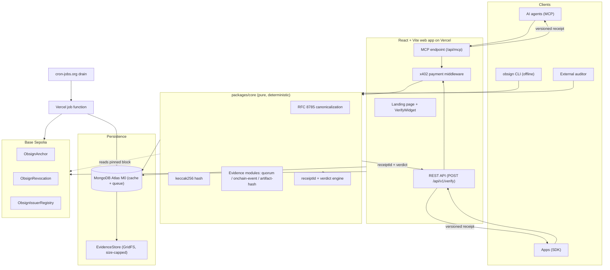

# Obsign

Verifiable credentials with recomputable receipts.

Obsign turns a claim like "I was there" or "this artifact is genuine" into a machine-checkable receipt that any person, app, or AI agent can verify independently. The verdict never depends on trusting our servers. Given the same credential and evidence, any third party can recompute the receipt ID byte for byte, offline, using nothing but the published spec and public chain state.

This repository is a monorepo. It currently ships a production quality landing page and defines the full product, from the pure verification core to the onchain anchor contracts, spread across build phases.

---

## Table of contents

- [What Obsign does](#what-obsign-does)
- [Repository layout](#repository-layout)
- [Architecture](#architecture)
- [The receipt](#the-receipt)
- [Design system](#design-system)
- [Getting started](#getting-started)
- [Usage guide](#usage-guide)
- [Development](#development)
- [Roadmap](#roadmap)
- [Contributing](#contributing)
- [License](#license)

---

## What Obsign does

Most ways of proving a real-world or online fact fail in one of two directions:

- A screenshot, PDF, or badge image can be forged by anyone.
- A row in someone's private database requires trusting that operator, and it dies alongside them.

Obsign offers a third option. A credential is only valid when its evidence actually verifies. That evidence is one of three machine-checkable primitives:

| Evidence kind | What it proves |
| --- | --- |
| Quorum | A threshold of independent co-signers approved the same message |
| Onchain event | A specific transaction or log exists on Base at a pinned block |
| Artifact hash | A fetched artifact matches a recorded SHA-256 checksum |

The validity verdict and the receipt ID are computed by a deterministic engine. Time and chain state are injected, never read from a hidden clock or a live "latest" block. Payments, when used, happen over x402 and never influence the verdict. The result is the same whether you call the paid API, the free CLI, or a third party reimplementation.

## Repository layout

```
obsign/
├── spec/                 # normative receipt + canonicalization spec
│   └── vectors/          # golden vectors (credential, evidence, expected receiptId)
├── packages/
│   ├── core/             # pure verifier, no network, no DB, no clock (INV-1)
│   └── sdk/              # typed client + offline verifier, published to npm
├── apps/
│   ├── web/              # React + Vite landing page (live in this repo today)
│   └── worker/           # bounded job functions drained by cron
├── contracts/            # Foundry project: anchor, revocation, issuer registry
├── cli/                  # standalone `obsign verify` for independent recomputation
└── ci/                   # shared CI configuration and checks
```

The `docs/prd.md` file is the source of truth for product intent. It is written as a phased build prompt, and each phase depends on the previous one passing its acceptance criteria.

## Architecture

The system is split between a pure, deterministic core and the network-facing layers that feed it. The core never performs I/O, reads a database, or consults the ambient clock; the current time and any chain reader are injected so the core stays reproducible everywhere.



### The flow

1. An issuer mints a credential and attaches machine-checkable evidence.
2. The receipt hash `keccak256(credentialHash || evidenceHash)` is committed on Base, giving it a public timestamp that cannot be silently rewritten.
3. A verifier presents the credential and evidence. The deterministic core evaluates the evidence module, checks the validity window and revocation state, and returns a verdict with a specific reason code.
4. The receipt ID never changes based on who asks or whether they paid. Anyone can reproduce it offline.

## The receipt

A receipt is the canonical result object that every verifier path returns:

```json
{
  "v": 1,
  "receiptId": "0x...",
  "credentialHash": "0x...",
  "evidenceHash": "0x...",
  "result": "valid",
  "reasonCode": "OK",
  "issuer": "0x...",
  "subject": "0x...",
  "verifiedAt": "2026-09-13T00:00:00.000Z",
  "verifier": "obsign-core/1.0.0",
  "anchor": { "chainId": 84532, "txHash": "0x...", "blockNumber": 12345678 },
  "paid": false
}
```

The heart of the design is the recomputable ID:

- `credentialHash = keccak256(utf8(JCS(credential)))`
- `evidenceHash = keccak256(utf8(JCS(evidenceSet)))`
- `receiptId = keccak256(concat(credentialHash, evidenceHash))`

Canonicalization follows RFC 8785 (JCS), so JSON key order does not matter and two machines hash the same bytes. Verdict metadata is appended outside the hashed inputs, so payment, latency, or who asked never touch the ID.

Every verification returns one of a fixed set of machine-readable reason codes (for example `OK`, `QUORUM_THRESHOLD_NOT_MET`, `EVENT_NOT_FOUND`, `REVOKED`). A bare boolean is never enough.

## Design system

The web app follows an organic neo-brutalist SaaS visual language: asymmetric cutout sections, notched and irregularly rounded cards, layered bento composition, crisp borders, and controlled gradients against a clean structure.

### Palette

The color palette is the single source of truth, defined in `docs/palette.svg`. All UI colors, gradients, surfaces, borders, and accents are derived from these five values:

| Color | Hex | Typical use |
| --- | --- | --- |
| Ink | `#000000` | Borders, hard shadows, footer |
| Navy | `#14213d` | Headings, dark surfaces, anchors |
| Accent | `#fca311` | Primary buttons, highlights, emphasis |
| Mist | `#e5e5e5` | Muted surfaces, input backgrounds |
| Paper | `#ffffff` | Page background, raised cards |

### Typography

- Headings and body: Montserrat (with Lato as a body fallback).
- Accent script: Great Vibes, used sparingly for brand moments.

Great Vibes is reserved for small decorative accents. It is never used for long-form copy, navigation, forms, or critical labels.

### Frontend stack

- React
- Vite
- TypeScript
- Vanilla CSS

No Tailwind, CSS-in-JS, or component library is used as the primary styling system. Components are built by hand and styled with a structured CSS architecture driven by design tokens in `apps/web/src/styles/tokens.css`.

## Getting started

### Prerequisites

- Node.js 18 or newer (the web app targets modern ES2020 class fields)
- npm 9 or newer
- A modern browser for the landing page
- Git for working with the repository

### Clone and install

```bash
git clone <your-fork-or-origin> obsign
cd obsign

# The landing page lives in the web app workspace.
cd apps/web
npm install
```

This installs the React, Vite, and TypeScript toolchain for the web app. The other workspaces (`packages/core`, `packages/sdk`, `apps/worker`, `cli`, `contracts`) are scaffolded in the monorepo and are wired up by their own phases, which are listed under [Roadmap](#roadmap).

### Run the landing page

```bash
cd apps/web
npm run dev
```

Vite starts a local dev server (by default at `http://localhost:5173`) with hot module reload. Open that URL in your browser.

### Production build

```bash
cd apps/web
npm run build
npm run preview
```

`npm run build` first type-checks with `tsc -b` and then produces an optimized bundle in `apps/web/dist`. `npm run preview` serves that build locally so you can confirm it behaves like production.

## Usage guide

### The landing page

The page is organized as four sections plus navigation and footer:

| Section | What it shows |
| --- | --- |
| Hero | Your one line of proof, the live verify widget, and the trust row |
| How it works | The Issue, Anchor, Verify flow and the receipt mini-diagram |
| Verifier modules | Quorum, Onchain event, and Artifact hash |
| Pricing | Flat price per verification and the final call to action |

### The live verify widget

On the hero you will find a working widget that mirrors the real verification flow. It has six states: idle, validating, valid, invalid, error, and unpaid.

- Paste a receipt ID or credential JSON to begin.
- Click **Try a sample** to load a bundled known-good vector and verify it.
- After a successful check, the recomputation panel shows `credentialHash`, `evidenceHash`, and `receiptId` so you can see exactly how the ID is derived.

The widget prefers the real API (`POST /api/v1/verify`) when it is reachable, and falls back to a local, offline recomputation otherwise. That offline path uses the same construction described in [The receipt](#the-receipt), implemented in `apps/web/src/lib/keccak.ts` with a dependency-free Keccak-256. This keeps the demo accurate and self-contained even before the backend service is deployed.

### Verification flow, step by step

1. Build or load a credential and its evidence.
2. Submit both to any verifier path (widget, API, SDK, or CLI).
3. The core canonicalizes the inputs with RFC 8785, hashes them with Keccak-256, and derives `credentialHash`, `evidenceHash`, and `receiptId`.
4. The relevant evidence module verifies the proof, and the validity window plus revocation state are checked against the injected time and chain reader.
5. You receive a versioned receipt with a verdict and a specific reason code.

Because the core is deterministic, the same inputs always yield the same `receiptId`, no matter who runs the check or whether a payment was attached.

## Development

### Conventions

- TypeScript is used with strict mode enabled across the workspaces.
- Shared config (TS config, ESLint, Prettier) is intended to live at the monorepo root so every package agrees on style and compiler settings.
- The web app keeps all styling in hand-written CSS: design tokens live in `apps/web/src/styles/tokens.css` and global primitives in `apps/web/src/styles/global.css`.
- Colors must always come from the palette. When a new tone is needed, derive it from one of the five source colors rather than inventing an unrelated hue.

### Project invariants

These rules override any other instruction. If a change would break one, stop and surface the conflict first.

| Invariant | Meaning |
| --- | --- |
| INV-1 | The core is pure. No network, database, ambient clock, or randomness inside `packages/core`. |
| INV-2 | Receipts are recomputable. A third party reproduces the same `receiptId` from the spec and vectors. |
| INV-3 | Payment never affects validity. API, CLI, and third party all agree. |
| INV-4 | The database is a cache. MongoDB is never required to recompute a receipt. |
| INV-5 | The LLM is outside the validity path. Model output can explain, never decide. |
| INV-6 | Chain reads are pinned. Verify against a specific block, never `latest`. |
| INV-7 | No plaintext issuer keys in MongoDB. Under Phase 3 self-custody, issuers hold their own keys and the server stores none — satisfied by construction. |

### Repository scripts

The web app package (`apps/web/package.json`) exposes:

| Command | Purpose |
| --- | --- |
| `npm run dev` | Start the Vite dev server with hot reload |
| `npm run build` | Type-check with `tsc -b`, then produce a production build |
| `npm run preview` | Serve the production build locally |
| `npm run typecheck` | Run the TypeScript compiler without emitting output |

## Roadmap

The product is being built in phases, each gated by its own acceptance criteria. The landing page described here is already live in the repository; the remaining phases build out the deterministic core, the onchain layer, the issuance platform, and the paid verification surface.

| Phase | Focus | Current status |
| --- | --- | --- |
| 0 | Foundations and spec: monorepo, canonicalization spec, golden vectors, CI | Scaffolded |
| 1 | Deterministic core and CLI: pure verifier, three evidence modules, `obsign verify` | Scaffolded |
| 2 | Onchain layer: anchor, revocation, issuer registry (+ policy registry) contracts on Base Sepolia, SDK ChainReader | Implemented (deploy runs in CI) |
| 3 | Issuance and multi-issuer platform: self-custodial issuers (SIWE), durable queue, evidence store, confirm/index worker, Fastify API on Render | Implemented (deploy runs on Render/CI) |
| 4 | Verification API, x402, and MCP: paid verify endpoint, MCP tools, SDK publish | Not started |
| 5 | Web app and landing page | Landing page + issuer console implemented |
| 6 | Hardening and mainnet launch: KMS migration, audit, mainnet deploy | Not started |

### Phase 3 — self-custodial issuance platform

Phase 3 deliberately supersedes the original PRD custody model. Issuers are
**self-custodial**: they connect their own wallet (RainbowKit + wagmi), sign in
with **SIWE** (EIP-4361), and submit `registerIssuer` / `anchor` / `revoke`
transactions **from their own address**, so `msg.sender == issuer` and P2-3
issuer-scoped revocation holds with **no funded platform relayer**. Because no
issuer key material ever reaches the server, INV-7 is satisfied by construction
(the `KeyProvider` / HD-seed model from PRD D12 / FR-3.1 / §4.2 is intentionally
dropped for issuers; `OBSIGN_HD_SEED` is reserved for the Phase 6 agent wallet).

Workspaces added:

- **`packages/platform`** — framework-agnostic domain + infra: Mongo cache/queue
  (INV-4), SIWE, GridFS evidence store, chain indexer, credential service.
- **`apps/api`** — a single **Fastify** service (deploys to **Render**) serving
  the REST + SIWE endpoints and the `CRON_SECRET`-guarded drain/webhook routes.
- **`apps/worker`** — the confirm/index handlers (`confirmAnchor`,
  `reflectRevocation`, `reapExpired`) driven by `runDrain`. It **watches** each
  submitted `txHash` to `ANCHOR_MIN_CONFIRMATIONS` and upserts the cache — it
  never sends transactions (a reinterpretation of FR-3.5 for self-custody).

Deploy notes (P3-5):

- **Render**: `apps/api/render.yaml` describes a single Node web service. Build
  `npm ci && npm run build -w @obsign/api` (esbuild bundles the workspace TS
  into `apps/api/dist/server.js`), start `node apps/api/dist/server.js`, health
  check `/api/v1/health`. Set `MONGODB_URI`, `BASE_SEPOLIA_RPC_URL`,
  `FRONTEND_ORIGIN`; `SESSION_JWT_SECRET` / `CRON_SECRET` can be generated.
- **cron-jobs.org**: schedule `POST /internal/cron/drain` with the `CRON_SECRET`
  (as `Authorization: Bearer <secret>` or `x-cron-secret`) to both keep the free
  service warm and drain the queue; `POST /internal/webhook/drain` triggers an
  immediate drain after issuance/revocation.
- **Preconditions**: Phase 2 CI green, and `contracts/deployments/84532.json`
  holds live addresses (it does — `resolveAddresses` throws on zero
  placeholders, so writes/reads fail fast otherwise).

## Contributing

Contributions are welcome. Please keep the non-negotiable invariants in mind and preserve the recomputable-receipt contract.

- Open an issue to discuss a change before opening a large pull request.
- Follow the TypeScript strict conventions and the styling rules above.
- If your change touches how a receipt is computed, add or update golden vectors so the contract stays frozen and testable.
- Never commit secrets, `.env` files, or key material.

## License

This project is open source and intended to stay that way. See the repository license file (once added) for the exact terms. Until then, reach out through the issue tracker if you plan to build on it.
