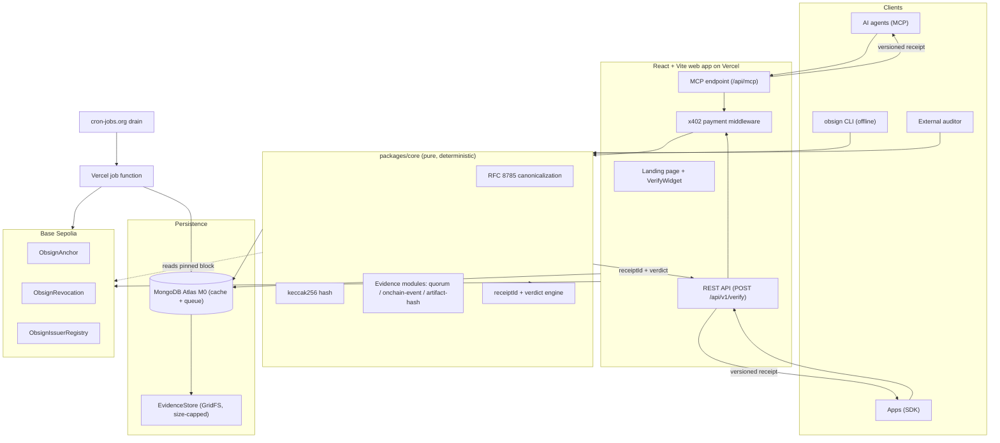

# Obsign

Verifiable credentials with recomputable receipts.

Obsign turns a claim like "I was there" or "this artifact is genuine" into a machine-checkable receipt that any person, app, or AI agent can verify independently. The verdict never depends on trusting our servers. Given the same credential and evidence, any third party can recompute the receipt ID byte for byte, offline, using nothing but the published spec and public chain state.

This repository is a monorepo. It currently ships a production quality landing page and defines the full product, from the pure verification core to the onchain anchor contracts, spread across build phases.

---

## Table of contents

- [What Obsign does](#what-obsign-does)
- [Repository layout](#repository-layout)
- [Architecture](#architecture)
- [The receipt](#the-receipt)
- [Design system](#design-system)
- [Getting started](#getting-started)
- [Usage guide](#usage-guide)
- [Development](#development)
- [Roadmap](#roadmap)
- [Contributing](#contributing)
- [License](#license)

---

## What Obsign does

Most ways of proving a real-world or online fact fail in one of two directions:

- A screenshot, PDF, or badge image can be forged by anyone.
- A row in someone's private database requires trusting that operator, and it dies alongside them.

Obsign offers a third option. A credential is only valid when its evidence actually verifies. That evidence is one of three machine-checkable primitives:

| Evidence kind | What it proves |
| --- | --- |
| Quorum | A threshold of independent co-signers approved the same message |
| Onchain event | A specific transaction or log exists on Base at a pinned block |
| Artifact hash | A fetched artifact matches a recorded SHA-256 checksum |

The validity verdict and the receipt ID are computed by a deterministic engine. Time and chain state are injected, never read from a hidden clock or a live "latest" block. Payments, when used, happen over x402 and never influence the verdict. The result is the same whether you call the paid API, the free CLI, or a third party reimplementation.

## Repository layout

```
obsign/
├── spec/                 # normative receipt + canonicalization spec
│   └── vectors/          # golden vectors (credential, evidence, expected receiptId)
├── packages/
│   ├── core/             # pure verifier, no network, no DB, no clock (INV-1)
│   └── sdk/              # typed client + offline verifier, published to npm
├── apps/
│   ├── web/              # React + Vite landing page (live in this repo today)
│   └── worker/           # bounded job functions drained by cron
├── contracts/            # Foundry project: anchor, revocation, issuer registry
├── cli/                  # standalone `obsign verify` for independent recomputation
└── ci/                   # shared CI configuration and checks
```

The `docs/prd.md` file is the source of truth for product intent. It is written as a phased build prompt, and each phase depends on the previous one passing its acceptance criteria.

## Architecture

The system is split between a pure, deterministic core and the network-facing layers that feed it. The core never performs I/O, reads a database, or consults the ambient clock; the current time and any chain reader are injected so the core stays reproducible everywhere.



### The flow

1. An issuer mints a credential and attaches machine-checkable evidence.
2. The receipt hash `keccak256(credentialHash || evidenceHash)` is committed on Base, giving it a public timestamp that cannot be silently rewritten.
3. A verifier presents the credential and evidence. The deterministic core evaluates the evidence module, checks the validity window and revocation state, and returns a verdict with a specific reason code.
4. The receipt ID never changes based on who asks or whether they paid. Anyone can reproduce it offline.

## The receipt

A receipt is the canonical result object that every verifier path returns:

```json
{
  "v": 1,
  "receiptId": "0x...",
  "credentialHash": "0x...",
  "evidenceHash": "0x...",
  "result": "valid",
  "reasonCode": "OK",
  "issuer": "0x...",
  "subject": "0x...",
  "verifiedAt": "2026-09-13T00:00:00.000Z",
  "verifier": "obsign-core/1.0.0",
  "anchor": { "chainId": 84532, "txHash": "0x...", "blockNumber": 12345678 },
  "paid": false
}
```

The heart of the design is the recomputable ID:

- `credentialHash = keccak256(utf8(JCS(credential)))`
- `evidenceHash = keccak256(utf8(JCS(evidenceSet)))`
- `receiptId = keccak256(concat(credentialHash, evidenceHash))`

Canonicalization follows RFC 8785 (JCS), so JSON key order does not matter and two machines hash the same bytes. Verdict metadata is appended outside the hashed inputs, so payment, latency, or who asked never touch the ID.

Every verification returns one of a fixed set of machine-readable reason codes (for example `OK`, `QUORUM_THRESHOLD_NOT_MET`, `EVENT_NOT_FOUND`, `REVOKED`). A bare boolean is never enough.

## Design system

The web app follows an organic neo-brutalist SaaS visual language: asymmetric cutout sections, notched and irregularly rounded cards, layered bento composition, crisp borders, and controlled gradients against a clean structure.

### Palette

The color palette is the single source of truth, defined in `docs/palette.svg`. All UI colors, gradients, surfaces, borders, and accents are derived from these five values:

| Color | Hex | Typical use |
| --- | --- | --- |
| Ink | `#000000` | Borders, hard shadows, footer |
| Navy | `#14213d` | Headings, dark surfaces, anchors |
| Accent | `#fca311` | Primary buttons, highlights, emphasis |
| Mist | `#e5e5e5` | Muted surfaces, input backgrounds |
| Paper | `#ffffff` | Page background, raised cards |

### Typography

- Headings and body: Montserrat (with Lato as a body fallback).
- Accent script: Great Vibes, used sparingly for brand moments.

Great Vibes is reserved for small decorative accents. It is never used for long-form copy, navigation, forms, or critical labels.

### Frontend stack

- React
- Vite
- TypeScript
- Vanilla CSS

No Tailwind, CSS-in-JS, or component library is used as the primary styling system. Components are built by hand and styled with a structured CSS architecture driven by design tokens in `apps/web/src/styles/tokens.css`.
